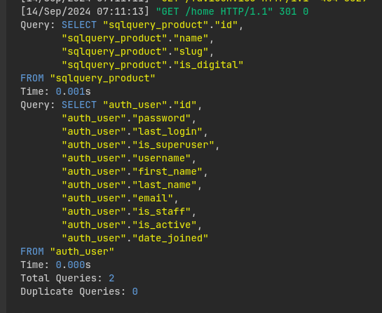
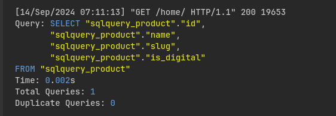
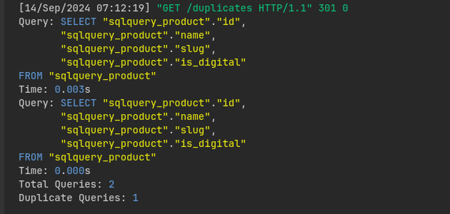

# Implemented a custom python decorator for examing your sql queries generated by Django

### You can check the following things from terminal logs:-

    1. Number of Queries

    2. Number of Duplicate Queries

    3. Sql Query itself

    4. Time taken to Query DB

### Cloning this repo? Follow as:-

    1. git clone https://github.com/ashiqYousuf/sqlqm.git

    2. Change directory to root dir (sqlqm)

    3. Create virtualenv & activate it

    4. Install requirements: pip install -r requirements.txt

    5. Run migrations: python3 manage.py migrate

    6. Start server: python3 manage.py runserver <PORT> 

